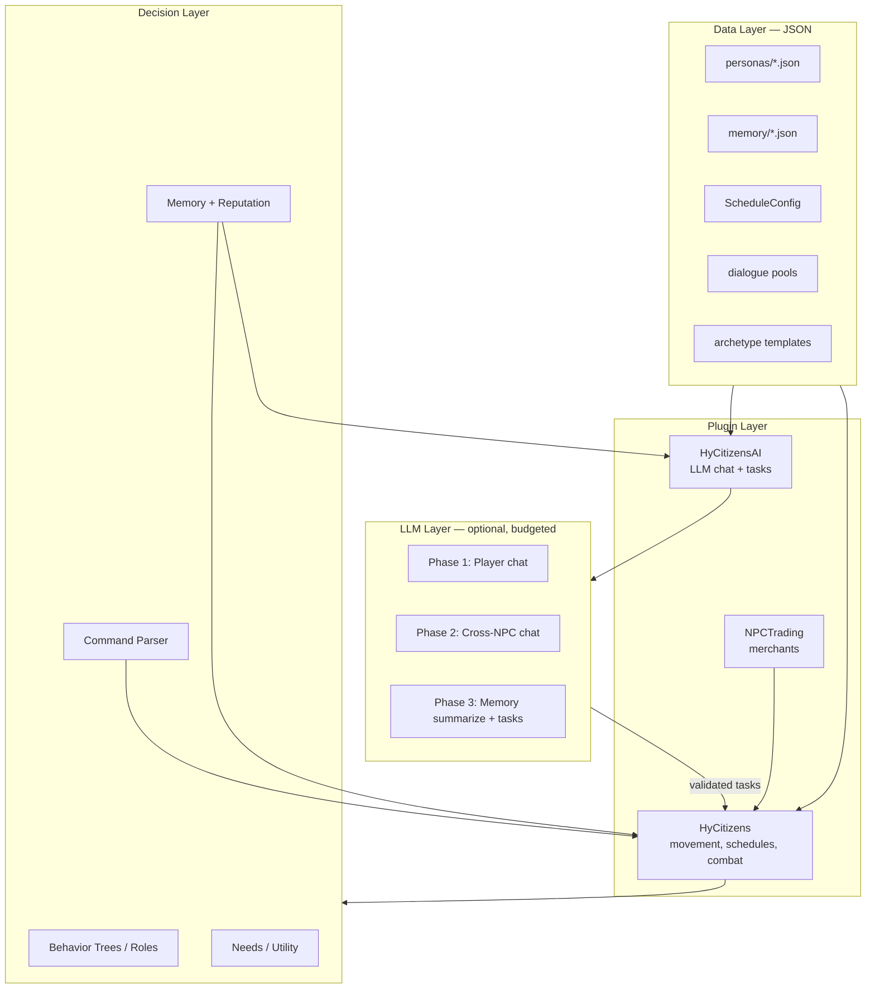

# Getting Started — Realistic NPCs & LLM Role-Play in Hytale

*A prioritized roadmap for building Erenshor-style living NPCs on top of the HyCitizens + NPCTrading stack, with light LLM flavor layered in where it matters most.*

Status: living guide · Last updated: 2026-05-25

---

## What you are building

The goal is not "AI NPCs." The goal is **NPCs that feel alive** — they have routines, remember you, react consistently, talk like characters, and keep living when you are not watching. Erenshor proves this works at scale with **logic trees + dialogue pools + memory**, not per-NPC LLMs.

This repo already has the foundation:

| Asset | Role |
|---|---|
| **`_mod-example-sourcecode/HyCitizens`** | Persistent NPCs — schedules, patrol, combat, groups, animations, interactions |
| **`_mod-example-sourcecode/NPCTrading`** | Merchant/trade layer — companion-plugin pattern for extending HyCitizens |
| **[research-llm-npc-roleplay.md](../research-bank/research-llm-npc-roleplay.md)** | Design for `HyCitizensAI` — LLM chat, cross-NPC talk, memory + tasks |
| **[research-erenshor-npcs.md](../research-bank/research-erenshor-npcs.md)** | Why believability beats intelligence; Erenshor's SimPlayer model |
| **[research-behavior-trees.md](../research-bank/research-behavior-trees.md)** | Data-driven BT design, blackboard, testing |
| **[research-advanced-npc-techniques.md](../research-bank/research-advanced-npc-techniques.md)** | Utility AI, GOAP, smart objects, A-Life, hybrid stacks |
| **`hytale-test-automation.md` (archived/missing)** | Test pyramid, FakePlayer spike, Actor abstraction |

---

## Guiding principles (read these first)

1. **Believability over intelligence.** Players forgive simple logic if it is consistent and reactive. They never see the tree; they see "that NPC remembered me."
2. **Deterministic systems drive 99% of behavior.** LLM is for flavor dialogue and rare "interesting moments," cached and budgeted aggressively. See [research-erenshor-npcs.md](../research-bank/research-erenshor-npcs.md).
3. **Data-driven everything.** Personalities, schedules, dialogue pools, and need profiles are JSON content — not hardcoded Java. New NPCs are content edits.
4. **The LLM proposes; the engine disposes.** No LLM ever executes game actions directly. It picks from a validated capability catalog mapped to HyCitizens APIs.
5. **Cost is the #1 risk for LLM features.** Rate limits, timeouts, fallbacks, and "no players nearby = no spend" are non-negotiable.

---

## Priority 1 — Realistic NPCs (Erenshor-style, no LLM required)

This is the highest-impact work and should come **before** any LLM integration. Erenshor's SimPlayers run on logic/behavior trees + text parsers + handwritten dialogue pools — not models.

### What "realistic" means here

| Erenshor technique | Hytale equivalent | Effort |
|---|---|---|
| Personality archetypes + dialogue pools | HyCitizens `MessagesConfig` + group-based canned lines | Low |
| Per-NPC memory (name, past adventures, gifts) | New `memory/<citizenId>.json` per citizen (Phase 3 of LLM doc, but implement deterministically first) | Low |
| Daily routines / off-screen progression | HyCitizens `ScheduleManager` + `RoleGenerator` | Medium |
| Grouping / party roles | HyCitizens groups (`getCitizensByGroup`) + follow schedules + flock/combat roles | Medium |
| Reputation / attitude shifts | Memory record gates greetings, prices, willingness to trade/group | Low |
| Command parsing (`/group`, `/pull`, `/careful`) | Keyword parser on chat → validated HyCitizens actions | Medium |
| Off-screen tick (6-hour sim while away) | Coarse A-Life-lite tick for unloaded chunks | High |

### Recommended deterministic stack

Build in this order (from [research-advanced-npc-techniques.md](../research-bank/research-advanced-npc-techniques.md)):

1. **Per-NPC memory record** — store player interactions; gate greetings, prices, and attitude. Highest believability per line of code.
2. **Personality archetypes + dialogue pools** — JSON personality type → pool of lines. Many NPCs, little authoring.
3. **Daily schedules** — time-of-day → activity/location via HyCitizens schedules. Makes a village feel inhabited.
4. **Needs/utility layer** — simple decaying needs (hunger, social, rest) picking weighted actions. One system, all NPC types.
5. **Off-screen tick** — when chunks unload, advance NPCs with a coarse model; reconcile on load.
6. **Reputation/faction graph** — opinions shift from player actions and propagate between NPCs.

### Behavior tree mindset

HyCitizens NPC behavior is already data-driven via JSON **Roles** (Sensors → Actions/Motions). Treat this as your behavior-tree layer:

- **Selector = priority list** — survival > combat > investigate > idle
- **Sequence = recipe** — walk to door → open → walk through
- **Blackboard = per-NPC state** — target, home, last known position, cooldowns
- **Reactive guards high and left** — "Am I hurt? → flee" sits above "patrol"

See [research-behavior-trees.md](../research-bank/research-behavior-trees.md) for design, maintenance, and deterministic tick testing.

### What HyCitizens gives you today

Out of the box via `/citizens`:

- Persistent NPCs with custom models, skins, armor, animations
- Passive / neutral / aggressive behavior and combat
- Daily schedules and routines; follow other citizens
- Patrol paths, wandering, leashing, detection (sight/hearing)
- Groups (hierarchical: `village/oakhollow/blacksmiths`)
- Hit/interact actions, canned messages, command triggers
- Developer API: `addCitizenInteractListener`, `getCitizensNear`, `ScheduleManager`, `RoleGenerator`, `triggerAnimations`

**NPCTrading** adds merchants via the companion-plugin pattern — the exact seam you will reuse for LLM chat.

---

## Priority 2 — Light LLM for communication & role-play

Add LLM **only after** deterministic NPCs feel solid. The LLM is a conversation layer on top of HyCitizens movement, schedules, combat, and trading — not a replacement for them.

### The three LLM phases (each shippable alone)

From [research-llm-npc-roleplay.md](../research-bank/research-llm-npc-roleplay.md):

| Phase | Outcome | LLM role | Cost profile |
|---|---|---|---|
| **1 — Player ↔ NPC chat** | Walk up, talk, get in-character reply | Full generative reply | Per-interaction; rate-limited |
| **2 — Cross-NPC chat** | NPCs near each other hold short overheard conversations | Turn-based ambient dialogue | Budgeted; no audience = no spend |
| **3 — Memory + tasks** | NPCs remember people/events; LLM proposes validated actions | Summarize memory + structured task output | Low-frequency; event-driven |

**Phase 1 alone is the LLM MVP.** Everything else is additive.

### Architecture: new companion plugin `HyCitizensAI`

Do not fork HyCitizens. Follow the NPCTrading pattern:

```java
PluginIdentifier id = new PluginIdentifier("com.electro", "HyCitizens");
if (PluginManager.get().getPlugin(id) == null) return;

HyCitizensPlugin.get().getCitizensManager().addCitizenInteractListener(event -> {
    CitizenData citizen = event.getCitizen();
    PlayerRef player = event.getPlayer();
    // route to LLM conversation
});
```

Key rules:

- **Async LLM calls** on `HytaleServer.SCHEDULED_EXECUTOR`; world mutations on `world.execute()`
- **Persona = JSON config** per citizen (`personas/<citizenId>.json`) — display name, backstory, speaking style, static `knowledge[]`, guardrails
- **Model tiering** — cheap model (Haiku-class) for ambient chatter; stronger model for quest NPCs
- **Graceful degradation** — timeout → fallback line ("Bram grunts and keeps hammering."); LLM down → HyCitizens canned messages

### The hybrid brain (critical for cost)

Never call the LLM every tick. Split brain from body (`hytale-test-automation.md` (archived/missing)):

```
Perception → Planner (LLM, low frequency) → Executor (deterministic, every tick)
```

- **Planner** — sets goals on triggers: player spoke, schedule changed, combat started. Runs every few seconds or on events.
- **Executor** — HyCitizens `ScheduleManager`, pathfinding, combat, animations. No LLM in the hot loop.
- **Working context** — last few conversation turns only; long-term facts live in persisted memory JSON.

### NPC body vs. FakePlayer body

| Archetype | Body | Why |
|---|---|---|
| Villagers, shopkeepers, quest-givers | HyCitizens NPC entity | Persistent, no tab-list, native pathfinding/combat |
| Adventurer companions, autonomous agents | FakePlayer (spike first) | Full player surface: mine, craft, inventory |
| Test bots | FakePlayer | Exercises real event path |

Run the **FakePlayer action spike** (chat → move → attack → break/place block) before committing to companion agents. See `hytale-test-automation.md` § B.6 (archived/missing).

### Testing from day one

Build these seams before shipping Phase 1:

- `LLMClient` interface → swap `FakeLLM` / `ReplayLLM` / `RealLLM`
- Transcript sink to assert NPC lines
- Unit tests for sanitizer, rate limiter, task validator (Layer 1 — every commit)
- `/hyai test <scenario>` runtime harness (Layer 3 — on merge)

---

## Priority 3 — Progression path: MVP → party → village

Build in vertical slices. Each milestone should be **playable and demoable** before moving on.

---

### Milestone A — Single NPC MVP

**Goal:** One NPC that feels like a character, not a mannequin.

**Scope (~1–2 weeks of focused work):**

1. **Spawn one citizen** in HyCitizens — custom name, model/skin, nametag, idle animation at a fixed location (e.g., village forge).
2. **Give them a schedule** — morning at forge, midday wander market, evening tavern. Verify `ScheduleManager` transitions roles/locations.
3. **Add canned personality** — 10–20 lines in `MessagesConfig` keyed to time-of-day or first interaction. No LLM yet.
4. **Add deterministic memory** — one JSON file tracking player UUID, name, visit count, one fact ("returned my hammer"). Gate the greeting on it.
5. **Optional: link a trader** via NPCTrading so they sell something thematic.
6. **Optional: Phase 1 LLM** — persona JSON + proximity chat. One NPC, rate-limited, with fallback lines.

**Done when:** A player can walk up, get a personality-consistent greeting that references past visits, watch the NPC move through their day, and optionally have a short in-character conversation.

**Key files to study:**

- `HyCitizens/src/main/resources/Server/NPC/Roles/Template_Citizen.json` — role/instruction model
- `NPCTrading/.../TraderInteraction.java` — companion-plugin hook
- `research-bank/research-llm-npc-roleplay.md` § 4–5 — persona model and Phase 1 flow

---

### Milestone B — 5-NPC adventurer party

**Goal:** A small group that feels like Erenshor's SimPlayer parties — distinct roles, group awareness, shared context.

**The party (example roster):**

| Role | Archetype | Deterministic behavior | LLM flavor |
|---|---|---|---|
| Tank | Gruff protector | Aggressive combat role, leads path | Short, commanding speech |
| Healer | Cautious support | Hangs back, flees at low HP | Worried, nurturing lines |
| Puller | Reckless scout | Wide wander radius, first to engage | Cocky, impatient |
| Crowd control | Calm tactician | Neutral, holds position | Measured, strategic |
| Merchant / quartermaster | Friendly trader | Linked NPCTrading, stays near camp | Haggling personality |

**Scope (~2–4 weeks):**

1. **Shared group** — put all five in HyCitizens group `party/iron-wolves`. Use `getCitizensByGroup` for proximity logic.
2. **Role-specific schedules** — shared camp location; tank/healer on patrol loop; puller on wider wander; merchant at camp.
3. **Follow behavior** — healer follows tank via `FOLLOW_CITIZEN` schedule activity when not in combat.
4. **Party memory** — shared or cross-referenced memory: "we cleared the goblin cave with {playerName}." Each NPC references it in greetings.
5. **Keyword command parser** — player says "pull" / "careful" / "regroup" near the party → deterministic action (puller advances, party holds, everyone moves to rally point). No LLM needed for commands.
6. **Group invite flow** — interact with tank → "Join our group?" → flag in player memory → party follows player on patrol.
7. **Phase 2 LLM (optional)** — when two+ party members stand near each other *and* a player is within range, occasional 3–6 line overheard banter with turn budget.

**Done when:** Player joins the party, gives simple commands, watches role-appropriate combat/movement, and overhears occasional party chatter that references shared history.

**Erenshor patterns to copy:**

- Fixed named characters with hand-authored knowledge + procedural personality variants
- MMO role assignment (tank, healer, puller, CC)
- Memory of shared adventures gates enthusiasm
- Rubber-banded progression (party levels roughly with player)

---

### Milestone C — Small living village (~15–25 NPCs)

**Goal:** A settlement that feels inhabited without the player — schedules, needs, economy, social fabric, off-screen life.

**Scope (~1–2 months, iterative):**

#### C.1 — Village skeleton (deterministic core)

1. **Zone layout** — forge, market, tavern, guard post, farm, temple, residential. Assign 2–4 NPCs per zone.
2. **Archetype templates** — 5–8 personality types (blacksmith, farmer, guard, innkeeper, priest, child, elder, wanderer). Each template = schedule + dialogue pool + need profile JSON.
3. **Procedural villagers** — like Erenshor's 140+ SimPlayers: random name + archetype + appearance from template. Hand-author 3–5 "special" named NPCs; generate the rest.
4. **Daily rhythm** — guards patrol at night; farmers work dawn–dusk; innkeeper active evening; most sleep overnight. Stagger schedules so the village never feels empty.
5. **Smart objects / affordances** — tag blocks/entities (forge, bed, chair, market stall) so NPCs query "what can I do here?" instead of hardcoding every location. Ideal for Hytale's block world ([research-advanced-npc-techniques.md](../research-bank/research-advanced-npc-techniques.md)).

#### C.2 — Social & economic layer

6. **Inter-NPC relationships** — simple opinion graph (friend/rival/neutral) between named NPCs. Gates cross-NPC dialogue topics.
7. **Economy loop** — 3–5 NPCTrading merchants with rotating stock; farmers "produce," blacksmith "consumes" iron (abstracted off-screen if needed).
8. **Reputation** — village faction opinion of player shifts from actions (helped farmer, stole from market). Propagates to prices and greetings.
9. **Director (optional)** — lightweight event pacer: "bandits spotted," "harvest festival," "merchant arrived." Injects variety so pure schedules do not feel flat.

#### C.3 — LLM & memory at village scale

10. **LLM only for special NPCs** — hand-author 5 named villagers with full persona JSON; generated villagers use dialogue pools only.
11. **Phase 2 ambient chat** — bounded, player-proximity-gated, cheapest model tier. Global concurrency cap (e.g., 2 simultaneous conversations server-wide).
12. **Phase 3 tasks** — named NPCs can propose schedule changes, remember promises, adjust trades. Validated against capability catalog.
13. **Off-screen tick** — when player leaves the village chunk, run coarse simulation: advance schedules, resolve abstract trades, update memory summaries. Reconcile on return (Erenshor's 6-hour model, scaled to your server).

**Done when:** Player can leave the village, return hours later, and find NPCs referencing events that happened while away — different NPCs in different places by time of day, economy churning, named characters with continuity, ambient chatter when nearby.

---

## Recommended build order (master checklist)

Work top-to-bottom. Do not skip ahead on LLM before deterministic layers feel good.

### Foundation (week 1)
- [ ] HyCitizens server running; one test NPC spawned and scheduled
- [ ] NPCTrading linked to one merchant NPC
- [ ] Read `Template_Citizen.json` and one real role variant end-to-end
- [ ] Deterministic memory JSON schema drafted (`memory/<citizenId>.json`)

### Milestone A — Single NPC MVP
- [ ] One NPC with schedule, canned personality, memory-gated greeting
- [ ] Optional: `HyCitizensAI` Phase 1 (one persona, rate limits, fallbacks)
- [ ] Layer 1 unit tests: sanitizer, rate limiter, prompt builder

### Milestone B — 5-NPC party
- [ ] Group system, role-specific schedules, follow behavior
- [ ] Keyword command parser for party commands
- [ ] Shared adventure memory across party members
- [ ] Optional: Phase 2 cross-NPC chat (budgeted, proximity-gated)
- [ ] FakePlayer action spike for companion feasibility

### Milestone C — Village
- [ ] Archetype templates + procedural villager generation
- [ ] Zone-based schedules + smart object affordances
- [ ] Economy loop via NPCTrading
- [ ] Reputation/faction graph
- [ ] LLM only on named specials; pools for the rest
- [ ] Off-screen tick (A-Life-lite)
- [ ] Optional: director for event pacing

---

## Architecture overview



---

## What not to do (common traps)

| Trap | Why it fails | Do instead |
|---|---|---|
| LLM drives movement/combat every tick | Cost, latency, unpredictability | Deterministic executor; LLM on events only |
| Unique Java per NPC | Does not scale past ~5 NPCs | Archetype templates + JSON params |
| Skip memory, go straight to LLM | Conversations feel hollow without continuity | Deterministic memory first; LLM summarizes later |
| Cross-NPC LLM chat without budgets | Runaway token spend | Turn budget, concurrency cap, no-audience gate |
| One mega-behavior-tree per NPC | Unmaintainable | Shared trees + per-NPC blackboard params |
| FakePlayer for every villager | Tab-list clutter, session entities, perf | NPC entity for villagers; FakePlayer for companions |

---

## Further reading (in repo)

| Document | When to read |
|---|---|
| [research-erenshor-npcs.md](../research-bank/research-erenshor-npcs.md) | Understanding the "living world" target and Erenshor's specific techniques |
| [research-behavior-trees.md](../research-bank/research-behavior-trees.md) | Designing and testing NPC decision logic |
| [research-advanced-npc-techniques.md](../research-bank/research-advanced-npc-techniques.md) | Choosing utility AI, GOAP, smart objects, A-Life for village scale |
| [research-llm-npc-roleplay.md](../research-bank/research-llm-npc-roleplay.md) | Full HyCitizensAI plugin design — persona model, phases, capability catalog |
| `hytale-test-automation.md` (archived/missing) | Test pyramid, Actor abstraction, FakePlayer spike |
| `_mod-example-sourcecode/HyCitizens/README.md` | In-game NPC management; [docs](https://hycitizens.com/docs) for API |
| `_mod-example-sourcecode/NPCTrading/README.md` | Trader API and HyCitizens integration pattern |

---

## External references

- [Erenshor Simulated Players Wiki](https://erenshor.wiki.gg/wiki/Simulated_Players)
- [Hytale NPC Technical Rundown](https://hytale.com/news/2026/2/npc-technical-rundown) — Roles, sensors/actions/motions
- [Stanford Generative Agents / Smallville](https://dl.acm.org/doi/fullHtml/10.1145/3586183.3606763) — memory → reflection → planning architecture (transferable without LLM)
- [Hytale Server API Reference](https://release.server.docs.hytale.com/)
