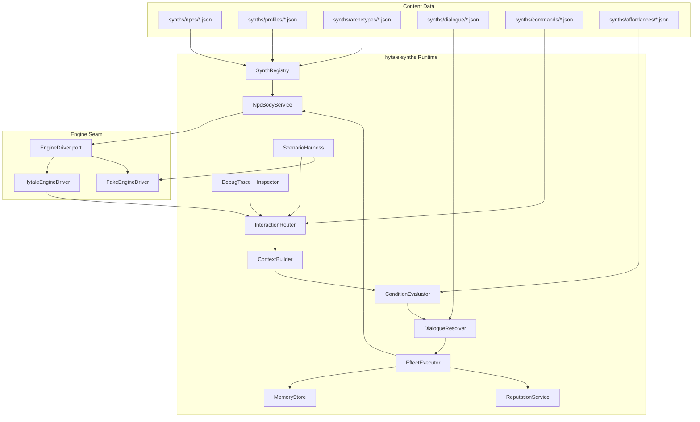

# Hytale Synthetics - `hytale-synths` MVP Project Plan

*A non-LLM-first, self-contained mod for building interactive, reactive, memorable, and testable NPCs out of reusable building blocks.*

Status: planning draft
Scope: MVP only
Dependencies: Hytale server API only (no mod dependencies)
Last updated: 2026-05-25

---

## 1. Goal

Build a new, **independent** Hytale server mod called **`hytale-synths`**.

The MVP goal is not to create open-ended LLM NPCs. The goal is to create a **deterministic, self-contained NPC framework** that gives server owners and content authors reusable, data-driven building blocks to assemble NPCs that:

- exist as real bodies the mod spawns and persists itself,
- remember players,
- choose contextual dialogue,
- react to simple world/player state,
- execute validated actions,
- expose inspectable state for debugging,
- and remain cheap, predictable, testable, and safe without model calls.

This mod stands on its own. It does **not** depend on HyCitizens, NPCTrading, or any other mod. It draws inspiration from the *concepts* those mods proved out — persistent NPCs, schedules, groups, animations, merchant exchange — but reimplements a deliberately **simplified, modular** subset as composable building blocks owned by this mod.

The mod should make a one-NPC blacksmith feel alive, end to end, before any LLM exists and without any companion plugin installed.

---

## 2. Source Docs Synthesized

This plan pulls durable ideas from the docs in this folder. The first six are direct design inputs. The last two are treated purely as **conceptual inspiration** — `hytale-synths` reimplements simplified versions of their ideas and does not depend on or integrate with them.

| Document | Useful takeaway for `hytale-synths` |
|---|---|
| [`getting-started.md`](./getting-started.md) | Build deterministic believability first: bodies, memory, schedules, dialogue pools, commands, reputation, then optional LLM later. |
| [`research-erenshor-npcs.md`](./research-erenshor-npcs.md) | Erenshor proves living NPCs can be mostly logic trees, dialogue pools, memory, grouping, command parsing, and off-screen progression. |
| [`research-behavior-trees.md`](./research-behavior-trees.md) | Use data-driven behavior, blackboard discipline, pure conditions, small actions, deterministic tick tests, and visual/debug traces. |
| [`research-advanced-npc-techniques.md`](./research-advanced-npc-techniques.md) | Smart objects, utility scoring, needs, perception, social graphs, and A-Life are additive layers; start with BT + blackboard + memory. |
| [`hytale-test-automation.md`](./hytale-test-automation.md) | Build seams early: fake/replayable inputs, transcript sinks, deterministic clocks, scenario harnesses, and an Actor abstraction. |
| [`LLM_NPC_ROLEPLAY.md`](./LLM_NPC_ROLEPLAY.md) | Keep a capability catalog and the rule "planner proposes, engine disposes," but implement it deterministically first. |
| [`HyCitizens/README.md`](./HyCitizens/README.md) | *Inspiration only.* Shows which NPC capabilities matter: spawn/persist, schedules, groups, animations, interactions, nearby lookups. We reimplement a simplified in-house subset; we do not depend on it. |
| [`NPCTrading/README.md`](./NPCTrading/README.md) | *Inspiration only.* Shows the merchant/exchange model worth having. We will build our own deferred trading sub-system; we do not depend on it. |

---

## 3. Product Positioning

`hytale-synths` is a **self-contained NPC framework**: it owns both the NPC *body* and the NPC *behavior*, assembled from small modules.

The mod owns:

**Body layer (simplified, in-house building blocks):**

- NPC definitions, spawning, and persistence,
- position, basic movement, animations,
- simple schedule/activity hooks,
- groups and interaction handling,
- a thin engine driver that is the only code touching raw Hytale APIs.

**Behavior layer:**

- declarative NPC interaction profiles,
- deterministic memory,
- dialogue pool selection,
- condition evaluation,
- effect execution,
- command parsing,
- player reputation and relationship state,
- blackboard/context assembly,
- debug inspection,
- scenario testing.

**Deferred sub-system (not MVP, but designed for):**

- trading/exchange — validated item exchange between **player↔NPC and NPC↔NPC**.

The only external dependency is the Hytale server API itself.

The core product promise:

> Assemble believable NPCs — body and behavior — from data and small modules, not custom Java per NPC and not a stack of companion plugins.

---

## 4. MVP Principles

1. **Self-contained.** No mod dependencies. The only thing required is the Hytale server.
2. **Non-LLM by default.** No token costs, no latency, no prompt injection, no model nondeterminism in the MVP.
3. **Building blocks over monoliths.** Body, memory, dialogue, conditions, effects, commands, and reputation are independent modules that compose. Take inspiration from existing mods; do not reimplement them wholesale.
4. **Data-driven content.** NPC bodies, profiles, dialogue pools, commands, memories, conditions, effects, and affordances live in JSON/JSONC-style content files.
5. **Small deterministic primitives.** Build reusable conditions and effects instead of bespoke scripts for each NPC.
6. **Engine authority.** The mod never "pretends" an action happened. It validates an effect and applies it through its own persisted state or the engine driver.
7. **Memory before cleverness.** A simple persisted memory record creates more believability than open-ended dialogue.
8. **Inspectable by design.** Every selected line, condition result, memory write, and effect execution should be explainable.
9. **One seam to the engine.** All raw Hytale API usage lives behind a single driver/port so core logic stays plain, testable Java and survives API churn.
10. **Future-compatible, not future-shaped.** The same capability catalog, context model, and effect validator can later support a trading sub-system and an LLM proposer, but the MVP must stand alone.

---

## 5. MVP User Story

As a server owner, I can define a blacksmith NPC named Bram entirely with `hytale-synths` content files.

`hytale-synths` spawns and persists Bram's body. When a player interacts with Bram:

- Bram greets them differently on the first visit, repeat visits, and after a favor.
- Bram remembers their name and key events.
- Bram can respond to simple typed commands like `help`, `work`, or `hammer`.
- Bram can play an animation, set a memory flag, and increment reputation.
- Bram's behavior and body state can be inspected with an admin command.
- A scenario test can replay the interaction deterministically.

Done well, the player should feel that Bram is a character with continuity even though no LLM, and no other mod, is involved.

---

## 6. MVP Scope

### In Scope

- Self-contained plugin skeleton: `hytale-synths`.
- Single engine driver seam (the only module importing Hytale APIs), plus a fake driver for tests.
- In-house NPC **body** module: definitions, spawning, persistence, animation, basic movement, and interaction handling.
- Per-NPC synthetic **behavior** profile files.
- Dialogue pools with deterministic weighted selection.
- Condition system.
- Effect system.
- Per-NPC and per-player memory store.
- Reputation/sentiment as simple numeric or enum state.
- Command parser for nearby/interacting NPCs.
- Interaction session routing.
- Admin/debug commands.
- Scenario test harness with fake interactions and transcript capture.
- Example content: one blacksmith NPC and one small village-ready archetype.

### Out of Scope for MVP

- The trading/exchange sub-system (designed-for but deferred; see §11.3 and §19).
- LLM calls.
- Cross-NPC generated conversations.
- Autonomous FakePlayer-style NPCs.
- Block mining/building/crafting automation.
- Full off-screen A-Life.
- Combat AI beyond what the body layer trivially exposes.
- Utility AI goal scoring beyond a minimal optional line-selection score.
- Visual behavior tree editor.
- Procedural village generation.
- Embeddings, semantic retrieval, or memory summarization.
- Complex quest framework.

---

## 7. Core Architecture



### Runtime Flow

1. The engine driver detects an interaction with a synth-managed NPC body.
2. The driver normalizes it into a `SynthEvent`.
3. `InteractionRouter` finds the matching profile by NPC id, group, or archetype.
4. `ContextBuilder` builds a deterministic context snapshot.
5. `ConditionEvaluator` filters possible responses/actions.
6. `DialogueResolver` selects a line from the best matching pool.
7. `EffectExecutor` applies validated effects (including body actions via the driver).
8. `MemoryStore` and `ReputationService` persist state changes.
9. `DebugTrace` records why the system chose what it chose.

---

## 8. Data Layout

Recommended plugin data layout:

```text
hytale-synths/
  config.json
  synths/
    npcs/
      bram_blacksmith.json
    profiles/
      bram_blacksmith.json
    archetypes/
      blacksmith.json
      guard.json
      villager.json
    dialogue/
      blacksmith_lines.json
      guard_lines.json
    commands/
      common_commands.json
      blacksmith_commands.json
    affordances/
      village_affordances.json
    scenarios/
      bram_first_visit.json
      bram_repeat_visit.json
  runtime/
    bodies/
      bram_blacksmith.json
    memory/
      npcs/
        bram_blacksmith.json
    traces/
      latest/
```

Content files are authored. Runtime body state, memory, and traces are generated.

---

## 9. Content Model

### 9.1 NPC Definition (Body)

The body definition is owned by this mod. It describes what to spawn and persist — a simplified subset of what a full NPC mod offers.

```jsonc
{
  "id": "bram_blacksmith",
  "enabled": true,
  "displayName": "Bram the Blacksmith",
  "model": "humanoid/villager_m",
  "skin": "blacksmith_apron",
  "equipment": {
    "mainHand": "Tool_Hammer"
  },
  "spawn": {
    "world": "oakhollow",
    "x": 124.5, "y": 64.0, "z": -88.5,
    "yaw": 90.0
  },
  "movement": {
    "mode": "anchored",
    "wanderRadius": 3
  },
  "schedule": {
    "template": "village_worker"
  },
  "groups": ["village/oakhollow", "profession/blacksmith"],
  "persist": true
}
```

### 9.2 Synthetic Profile (Behavior)

Profiles bind a synth-owned NPC body to synthetic behavior. The profile references the body by id; both are owned by this mod.

```jsonc
{
  "id": "bram_blacksmith",
  "enabled": true,
  "npcId": "bram_blacksmith",
  "archetype": "blacksmith",
  "groups": ["village/oakhollow", "profession/blacksmith"],
  "dialoguePools": ["blacksmith_lines"],
  "commandSets": ["common_commands", "blacksmith_commands"],
  "memory": {
    "enabled": true,
    "trackPlayers": true,
    "maxFactsPerPlayer": 20
  },
  "reputation": {
    "defaultSentiment": "neutral",
    "friendlyAt": 25,
    "hostileAt": -25
  },
  "voice": {
    "nameColor": "GOLD",
    "textColor": "WHITE",
    "fallbackLine": "Bram nods and turns back to the forge."
  },
  "debug": {
    "traceInteractions": true
  }
}
```

### 9.3 Archetype

Archetypes are reusable defaults shared by many NPCs — for both body and behavior.

```jsonc
{
  "id": "blacksmith",
  "baseTraits": ["proud", "practical", "work-focused"],
  "body": {
    "defaultModel": "humanoid/villager_m",
    "defaultScheduleTemplate": "village_worker",
    "suggestedGroups": ["profession/blacksmith"],
    "animations": {
      "greet": "Idle_Wave",
      "busy": "Idle_Work",
      "celebrate": "Idle_Celebrate"
    }
  },
  "defaultDialoguePools": ["blacksmith_lines"],
  "defaultCommandSets": ["common_commands"],
  "defaultMemoryKeys": ["visit_count", "last_seen", "favor_returned"]
}
```

### 9.4 Dialogue Pool

Dialogue is selected by conditions, priority, weight, cooldowns, and memory.

```jsonc
{
  "id": "blacksmith_lines",
  "lines": [
    {
      "id": "first_visit_greeting",
      "priority": 100,
      "weight": 1,
      "when": [
        { "type": "player.memory.missing", "key": "seen_bram" }
      ],
      "say": "New face at my forge. Name's Bram. Need tools, repairs, or trouble?",
      "effects": [
        { "type": "memory.set", "scope": "player", "key": "seen_bram", "value": true },
        { "type": "memory.increment", "scope": "player", "key": "visit_count", "amount": 1 }
      ]
    },
    {
      "id": "repeat_visit_greeting",
      "priority": 80,
      "weight": 4,
      "when": [
        { "type": "player.memory.equals", "key": "seen_bram", "value": true }
      ],
      "say": "Back again, {player.name}? Good. Means the last tool held up.",
      "effects": [
        { "type": "memory.increment", "scope": "player", "key": "visit_count", "amount": 1 }
      ]
    },
    {
      "id": "friendly_aside",
      "priority": 90,
      "weight": 1,
      "cooldownSeconds": 900,
      "when": [
        { "type": "reputation.atLeast", "target": "player", "value": 25 }
      ],
      "say": "For you, I'll set aside the better iron. Don't make me regret it."
    }
  ]
}
```

### 9.5 Command Set

Commands convert player text into validated deterministic intents.

```jsonc
{
  "id": "blacksmith_commands",
  "commands": [
    {
      "id": "ask_work",
      "match": {
        "mode": "keywords",
        "any": ["work", "busy", "doing"]
      },
      "say": "Forging. Always forging. Steel doesn't shape itself.",
      "effects": [
        { "type": "animation.play", "name": "Idle_Work" }
      ]
    },
    {
      "id": "hammer_favor",
      "match": {
        "mode": "keywords",
        "all": ["hammer"],
        "any": ["found", "returned", "bring"]
      },
      "when": [
        { "type": "player.inventory.has", "item": "Tool_Hammer_Bram", "count": 1 }
      ],
      "say": "That's mine. Thought I'd lost it for good. You've earned my trust.",
      "effects": [
        { "type": "player.inventory.remove", "item": "Tool_Hammer_Bram", "count": 1 },
        { "type": "reputation.add", "target": "player", "amount": 30 },
        { "type": "memory.set", "scope": "player", "key": "returned_hammer", "value": true },
        { "type": "animation.play", "name": "Idle_Celebrate" }
      ]
    }
  ]
}
```

### 9.6 Memory Record

Runtime memory should be compact, human-readable, and safe to inspect.

```jsonc
{
  "npcId": "bram_blacksmith",
  "profileId": "bram_blacksmith",
  "players": {
    "<playerUuid>": {
      "name": "Chad",
      "sentiment": "friendly",
      "reputation": 30,
      "facts": {
        "seen_bram": true,
        "visit_count": 4,
        "returned_hammer": true
      },
      "notes": [
        {
          "id": "returned_hammer_001",
          "text": "Returned Bram's missing hammer.",
          "createdAt": 1779734400000
        }
      ],
      "lastSeenAt": 1779734400000
    }
  },
  "events": []
}
```

---

## 10. Core Building Blocks

### 10.1 `EngineDriver` (the one seam)

A single port that abstracts all raw Hytale API usage. The default implementation talks to the live engine; a fake implementation drives tests and scenarios.

Responsibilities:

- spawn / despawn an NPC body from a definition,
- persist and restore body state,
- move / anchor a body,
- play an animation,
- read basic body metadata and nearby bodies,
- send rich-text messages to players,
- surface interaction and chat events as `SynthEvent`s.

This is the only module that imports Hytale classes. Everything else is plain Java.

### 10.2 `NpcBodyService`

The in-house body building block. Owns NPC lifecycle independent of behavior:

- loads `NpcDefinition`s from content,
- spawns bodies through the driver,
- persists/restores body runtime state,
- exposes lookups by id, group, and proximity,
- applies body actions (animation, movement, anchor) requested by effects.

Kept deliberately simple: anchored/wander movement and a coarse schedule template are enough for the MVP. Patrols, combat, and rich schedules are later layers.

### 10.3 `SynthEvent`

Normalized event object used by the whole mod.

Fields:

- `eventId`
- `type`: `INTERACT`, `CHAT_NEAR_NPC`, `SCHEDULE_TICK`, `ADMIN_TEST`
- `npcId`
- `profileId`
- `playerId`
- `playerName`
- `messageText`
- `position`
- `worldTime`
- `source`

This prevents engine-specific event details from leaking into every subsystem.

### 10.4 `SynthContext`

Read-only context snapshot for one decision.

Suggested fields:

- NPC profile,
- player identity,
- player memory,
- NPC memory,
- group ids,
- world time bucket,
- nearby NPC bodies,
- current schedule/activity,
- last interaction timestamp,
- command parse result,
- debug flags.

Conditions read from `SynthContext`. Effects mutate through services, never through context.

### 10.5 Condition Library

MVP condition types:

| Type | Purpose |
|---|---|
| `always` | Default match. |
| `player.memory.exists` / `missing` / `equals` | Gate lines by remembered facts. |
| `npc.memory.exists` / `equals` | Gate by NPC-local state. |
| `reputation.atLeast` / `below` | Gate attitude and privileges. |
| `world.time.between` | Morning/evening/night dialogue. |
| `npc.group.includes` | Role/group-specific behavior. |
| `npc.capability.has` | Gate on body/sub-system capabilities (reserved for trading later). |
| `player.inventory.has` | Favor/quest hand-in checks. |
| `cooldown.ready` | Prevent repeated rare lines. |
| `random.chance` | Low-stakes variety only, seeded in tests. |

Rules:

- Conditions are pure.
- Conditions do not write memory.
- Conditions return structured debug output: `pass`, `fail`, and `reason`.
- Unknown condition type fails closed and logs a warning.

### 10.6 Effect Library

MVP effect types:

| Type | Purpose |
|---|---|
| `say` | Render a dialogue line. Usually implicit from selected line. |
| `memory.set` / `increment` / `appendNote` | Persist player/NPC state. |
| `reputation.add` / `setSentiment` | Update relationship state. |
| `animation.play` | Trigger a body animation through the driver. |
| `message.player` | Send private text to the player. |
| `player.inventory.remove` | Consume favor/quest items. |
| `schedule.flag` | Set a synth-owned flag that later maps to schedule choices. |
| `debug.trace` | Add explicit debug breadcrumb. |

Reserved for the deferred trading sub-system (validated but not implemented in MVP): `exchange.open`, `exchange.give`, `exchange.take`.

Rules:

- Effects validate before executing.
- Effects execute on the correct thread for the target API (the driver owns thread-hops).
- Unknown effect types are rejected and traced.
- Failed effects should not prevent safe later effects unless marked `required`.
- Effects should be idempotent where possible.

### 10.7 Dialogue Resolver

Selection algorithm:

1. Gather dialogue pools from profile and archetype.
2. Filter lines where all `when` conditions pass.
3. Sort by `priority` descending.
4. Keep the highest priority band.
5. Exclude lines on cooldown.
6. Weighted-select among remaining lines with seeded RNG.
7. Render placeholders.
8. Execute effects.
9. Store trace.

This gives author control while preserving variety.

### 10.8 Command Parser

MVP parser should be intentionally simple:

- lowercase text,
- strip punctuation,
- token match,
- `all` and `any` keyword groups,
- optional exact phrase match,
- no natural language model.

This is enough for Erenshor-style commands:

- `help`
- `work`
- `follow`
- `regroup`
- `careful`
- `pull`
- `rumors`

Command resolution should prefer:

1. active interaction session target,
2. nearest faced synth-managed NPC,
3. nearest synth-managed NPC in range,
4. no match.

---

## 11. Module & Sub-system Design

### 11.1 Engine Driver

A single port (§10.1) with two implementations: `HytaleEngineDriver` for the live server and `FakeEngineDriver` for tests/scenarios. Isolating the engine here is what keeps the rest of the mod plain Java and resilient to Hytale API churn.

### 11.2 NPC Body Module

The in-house body layer (§10.2). It is intentionally a *simplification* of what a full NPC mod offers — enough to spawn, persist, animate, anchor/wander, group, and surface interactions. It exposes a clean internal API so the behavior layer never reaches past it to the engine.

### 11.3 Trading / Exchange Sub-system (Deferred)

Not implemented in the MVP, but the architecture reserves space for it. When built, it should be a self-contained module supporting validated item exchange in two directions:

- **Player ↔ NPC** — merchant offers, item rotation, reputation-gated pricing.
- **NPC ↔ NPC** — NPCs moving goods between themselves (e.g., a trader restocking a stall, a villager handing produce to a cook).

It should reuse the existing seams rather than introduce parallel ones:

- effects: `exchange.open`, `exchange.give`, `exchange.take` (reserved in §10.6),
- conditions: `npc.capability.has` (reserved in §10.5),
- the same `EffectExecutor` validation and debug tracing.

Treating it as a sub-system from day one means it slots into the existing validator and trace tooling instead of becoming a fork.

### 11.4 Future LLM Adapter

Also not implemented in the MVP, but the architecture should leave room for:

- passing `SynthContext` to a model,
- accepting structured proposed effects,
- validating those effects through the same `EffectExecutor`,
- rendering the same transcript/debug output.

If this seam is clean, adding an LLM later is an adapter, not a rewrite.

---

## 12. Admin and Debug Commands

Suggested MVP commands:

| Command | Purpose |
|---|---|
| `/synths reload` | Reload NPC definitions, profiles, dialogue, commands, and archetypes. |
| `/synths spawn <npcId>` | Spawn (or respawn) a synth-managed NPC body. |
| `/synths inspect <npcId>` | Show body state, profile, archetype, pools, memory summary, and last trace. |
| `/synths memory <npcId> <player>` | Show player-specific memory for that NPC. |
| `/synths forget <npcId> <player> <key>` | Remove one memory key. |
| `/synths trace <npcId>` | Toggle or show recent decision traces. |
| `/synths test <scenarioId>` | Run a deterministic scenario. |
| `/synths doctor` | Validate content files and engine driver. |

### Debug Trace Shape

```jsonc
{
  "traceId": "trace_001",
  "event": "INTERACT",
  "npcId": "bram_blacksmith",
  "player": "Chad",
  "matchedProfile": "bram_blacksmith",
  "candidateLines": 8,
  "passedLines": ["repeat_visit_greeting", "friendly_aside"],
  "selectedLine": "friendly_aside",
  "conditions": [
    { "id": "reputation.atLeast", "passed": true, "reason": "30 >= 25" }
  ],
  "effects": [
    { "type": "memory.increment", "status": "applied", "key": "visit_count" }
  ]
}
```

The trace is critical. Without it, content authors cannot understand why an NPC said something.

---

## 13. MVP Milestones

### Milestone 0 - Repository and Plugin Skeleton

Goal: a loadable, self-contained `hytale-synths` plugin with a clean engine seam.

Stories:

- [ ] Create plugin metadata and Java plugin lifecycle.
- [ ] Add `SynthConfig` with global enable flag and debug settings.
- [ ] Define the `EngineDriver` port.
- [ ] Add `HytaleEngineDriver` (live) and `FakeEngineDriver` (tests).
- [ ] Add `/synths doctor`.

Acceptance criteria:

- Server starts with the plugin and reports a healthy engine driver.
- `/synths doctor` reports config and driver status.
- No Hytale imports exist outside the engine package.

### Milestone 1 - NPC Body Module

Goal: the mod can spawn and persist its own NPC body with no other mod present.

Stories:

- [ ] Define the `NpcDefinition` schema.
- [ ] Implement `NpcBodyService` spawn/despawn through the driver.
- [ ] Implement body state persistence and restore on restart.
- [ ] Implement anchored/wander movement and animation playback.
- [ ] Implement nearby/by-group/by-id lookups.
- [ ] Add `/synths spawn`.

Acceptance criteria:

- `/synths spawn bram_blacksmith` creates a persistent NPC at the defined location.
- The body survives plugin reload/server restart.
- An animation can be played on the body through the driver.
- No companion mod is required.

### Milestone 2 - Content Loading and Validation

Goal: load definitions and profiles and fail content errors safely.

Stories:

- [ ] Define NPC definition, profile, archetype, dialogue pool, command set, and scenario schemas.
- [ ] Implement `SynthRegistry`.
- [ ] Implement reload command.
- [ ] Add validation for duplicate ids, unknown pools, unknown command sets, invalid weights, unknown condition/effect types, and dangling `npcId` references.
- [ ] Add example `bram_blacksmith` content.

Acceptance criteria:

- `/synths reload` loads valid files without restart.
- Invalid content is reported with file path and reason.
- A broken profile cannot crash interaction handling.
- Example content passes validation.

### Milestone 3 - Memory and Reputation

Goal: persistent deterministic continuity per NPC/player.

Stories:

- [ ] Implement `MemoryStore` with atomic JSON writes.
- [ ] Implement per-NPC/per-player facts.
- [ ] Implement visit counts, first-seen, last-seen.
- [ ] Implement `ReputationService`.
- [ ] Add `/synths memory` and `/synths forget`.

Acceptance criteria:

- A first interaction writes `seen_<npc>` or equivalent.
- Repeated interaction reads memory and selects a different line.
- Memory survives reload/restart.
- Reputation gates at least one line.

### Milestone 4 - Dialogue Resolver

Goal: contextual canned lines that feel authored but reactive.

Stories:

- [ ] Implement condition evaluation.
- [ ] Implement weighted priority line selection.
- [ ] Implement cooldown tracking.
- [ ] Implement placeholder rendering for player name, NPC name, time bucket, reputation, and simple facts.
- [ ] Render selected line to the player.
- [ ] Trace selection.

Acceptance criteria:

- First visit and repeat visit select different lines.
- Friendly reputation selects a friendly line.
- Cooldown prevents spam of rare lines.
- Trace shows passed/failed conditions and selected line.

### Milestone 5 - Effects

Goal: lines can safely change state and trigger body behavior.

Stories:

- [ ] Implement memory effects.
- [ ] Implement reputation effects.
- [ ] Implement animation effect through the body module.
- [ ] Implement private message effect.
- [ ] Implement inventory-remove effect.
- [ ] Add effect validation and failure tracing.

Acceptance criteria:

- Interaction can increment visit count and play an animation.
- A favor hand-in removes the item and adds reputation.
- Malformed effect is rejected and logged.
- Failed non-required effect does not block later effects or dialogue.

### Milestone 6 - Command Parser and Interaction Sessions

Goal: players can type simple contextual commands near or after interacting with NPCs.

Stories:

- [ ] Add short-lived player-to-NPC interaction sessions.
- [ ] Route chat to active session when present.
- [ ] Route chat to nearby/faced NPC when no session exists.
- [ ] Implement keyword command matching.
- [ ] Add example blacksmith commands: `work`, `help`, `hammer`.
- [ ] Add command traces.

Acceptance criteria:

- Player interacts with Bram, types `hammer` with the required item, and gets memory/reputation update.
- Player command with no matching NPC remains normal chat or fails quietly per config.
- Commands do not execute if conditions fail.

### Milestone 7 - Scenario Harness

Goal: repeatable automated confidence without a live human tester.

Stories:

- [ ] Define scenario JSON format.
- [ ] Add fake event ingestion via `FakeEngineDriver`: interact, chat, set memory, assert line, assert memory.
- [ ] Add transcript sink.
- [ ] Add seeded RNG and injectable clock for scenario runs.
- [ ] Implement `/synths test <scenarioId>`.
- [ ] Add three scenarios: first visit, repeat visit, hammer favor.

Acceptance criteria:

- Scenario run prints pass/fail.
- Failed assertion includes expected vs actual.
- Dialogue selection is deterministic under seed.
- Scenario can assert memory and reputation changes.

### Milestone 8 - MVP Demo Pack

Goal: one compelling vertical slice, fully self-contained.

Stories:

- [ ] Package Bram NPC definition and profile.
- [ ] Package blacksmith archetype.
- [ ] Package dialogue and commands.
- [ ] Write a short setup/demo section in this doc or a separate README.
- [ ] Run doctor and scenario tests.

Acceptance criteria:

- A server owner installs only `hytale-synths`, runs `/synths spawn`, and gets a working synthetic character.
- The demo proves body spawn/persist, memory, dialogue, commands, effects, debug trace, and scenario test.
- No LLM and no companion mod exist or are required.

---

## 14. Suggested Package Boundaries

```text
com.example.hytalesynths
  HytaleSynthsPlugin.java
  config/
    SynthConfig.java
  engine/
    EngineDriver.java
    HytaleEngineDriver.java
    FakeEngineDriver.java
  npc/
    NpcBodyService.java
    NpcDefinition.java
    BodyStateStore.java
  content/
    SynthRegistry.java
    ProfileLoader.java
    ContentValidator.java
    model/
  runtime/
    InteractionRouter.java
    ContextBuilder.java
    DialogueResolver.java
    ConditionEvaluator.java
    EffectExecutor.java
    CommandParser.java
  memory/
    MemoryStore.java
    ReputationService.java
  debug/
    DebugTrace.java
    TraceStore.java
  commands/
    SynthsCommand.java
  scenarios/
    ScenarioHarness.java
    ScenarioRunner.java
```

Boundary rule:

- `engine/` is the only package that knows raw Hytale APIs.
- `npc/`, `runtime/`, `memory/`, and `content/` should be mostly plain Java and unit-testable (the body module talks to the engine only through the driver).
- `scenarios/` drives the same public runtime interfaces used by real events, backed by `FakeEngineDriver`.

---

## 15. Testing Strategy

### Layer 1 - Plain Unit Tests

Run every commit.

Test:

- NPC definition and profile validation,
- condition evaluation,
- effect validation,
- dialogue selection,
- command parsing,
- memory merge/update,
- placeholder rendering,
- seeded RNG behavior.

### Layer 2 - Scenario Tests

Run on demand and on merge, backed by `FakeEngineDriver`.

Test:

- first visit flow,
- repeat visit flow,
- reputation-gated line,
- favor command,
- failed command condition,
- memory persistence round-trip,
- body spawn/persist/restore round-trip.

### Layer 3 - Runtime Smoke

Run manually in a server.

Test:

- `/synths spawn` creates a persistent body,
- interaction event reaches `InteractionRouter`,
- animation playback works,
- message rendering works,
- reload does not break active sessions or spawned bodies.

### Layer 4 - Soak/Content Validation

Run before release.

Test:

- load 50-100 NPC definitions/profiles,
- spawn and persist many bodies,
- simulate 1,000 interactions,
- ensure no invalid line selection,
- ensure memory and body files stay bounded,
- ensure debug traces rotate.

---

## 16. MVP Risks

| Risk | Why it matters | Mitigation |
|---|---|---|
| Hytale API churn | Server APIs are young and may shift. | Isolate all engine usage behind the single `EngineDriver` and keep core logic plain Java. |
| Owning the body is more work | We no longer get spawn/persist/animation for free from another mod. | Keep the body module a deliberate simplification: anchored/wander movement, basic animation, coarse schedule. Defer patrols/combat. |
| Content complexity | JSON can become unreadable. | Small schemas, validation, examples, `/synths doctor`, and debug traces. |
| Memory bloat | Per-player facts can grow forever. | Max facts per player, compact notes, admin forget command. |
| Command ambiguity | Nearby NPCs may all match player text. | Active sessions first, facing/nearest fallback, trace routing decision. |
| Threading mistakes | World mutation from the wrong thread can break runtime. | The driver owns all thread-hops; core effects are declarative. |
| Overbuilding | MVP can drift into trading/GOAP/LLM/autonomy. | Keep milestone acceptance tied to the Bram vertical slice; trading and LLM stay reserved seams. |

---

## 17. What "Done" Means for the MVP

The MVP is done when all of this works with **only** `hytale-synths` installed:

1. `hytale-synths` loads as a self-contained plugin.
2. It spawns and persists its own NPC body from a definition.
3. It can bind a behavior profile to that NPC.
4. Interacting with the NPC selects contextual dialogue from data.
5. First and repeat visits differ because memory is persisted.
6. Reputation gates at least one response.
7. A simple typed command can trigger a validated effect.
8. Admins can inspect body state, memory, and traces.
9. Scenario tests can replay the core interaction without a human.
10. No LLM, model key, network call, prompt, or companion mod is required.

---

## 18. Recommended First Vertical Slice

Build Bram. Keep him small and prove the whole loop — body and behavior.

### Bram Content

- NPC definition: `bram_blacksmith` (model, skin, hammer, forge spawn point).
- Profile: `bram_blacksmith`.
- Archetype: `blacksmith`.
- Dialogue:
  - first visit,
  - repeat visit,
  - morning work line,
  - evening line,
  - friendly line,
  - unfriendly line,
  - hammer favor completion.
- Commands:
  - `work`,
  - `help`,
  - `hammer`,
  - `rumor`.
- Effects:
  - set seen flag,
  - increment visit count,
  - add reputation,
  - remove favor item,
  - play animation.
- Tests:
  - body spawn/persist round-trip,
  - first visit,
  - repeat visit,
  - hammer favor,
  - malformed content validation.

This vertical slice exercises every MVP subsystem — including the in-house body — without requiring a village, party, autonomy, trading, or LLM.

---

## 19. Later Expansion Path

After the MVP, expand in this order:

1. **Trading / exchange sub-system** - validated player↔NPC and NPC↔NPC item exchange, reusing the reserved `exchange.*` effects and `npc.capability.has` condition.
2. **Party commands** - `follow`, `regroup`, `careful`, `pull`, shared group memory.
3. **Smart affordances** - forge, chair, bed, stall, guard post advertise possible actions.
4. **Richer body layer** - patrols, combat hooks, fuller schedules beyond anchored/wander.
5. **Needs layer** - hunger, rest, social, work, safety as simple decaying values.
6. **Social graph** - NPC-to-NPC opinions and faction reputation.
7. **Off-screen tick** - coarse memory/economy/schedule updates while unloaded.
8. **Optional LLM adapter** - model proposes the same validated effects the deterministic command system already uses.

---

## 20. Design Mantra

`hytale-synths` should make NPCs feel alive by making simple things compose — and by owning just enough of the body to do it without leaning on another mod:

- a spawned, persistent body,
- a remembered fact,
- a better line,
- a visible reaction,
- a validated effect,
- a trace explaining why.

That is the MVP. Trading, autonomy, and cleverness come later, if the deterministic foundation earns them.

---

## 21. Codex Review Feedback

### Overall Assessment

This is a strong direction. The document correctly absorbs the repo's main lesson: believable NPCs should be deterministic, memoryful, inspectable, and data-driven before any LLM or autonomous-agent layer exists. The plan is also right to make `hytale-synths` self-contained if the product goal is "install one mod and get living NPCs."

The main risk is not the behavior layer. Memory, dialogue pools, commands, traces, and scenario tests are all well-scoped. The main risk is the body layer: replacing HyCitizens means this mod must now own the Hytale NPC/Role asset surface, spawn/persist lifecycle, movement constraints, animation validity, thread hops, and reload behavior. That is achievable, but it deserves its own feasibility gate before the rest of the roadmap assumes it is easy.

### Highest-Priority Feedback

1. **Add a Milestone 0 feasibility spike for synth-owned bodies.**
   Before building the full body module, prove the exact Hytale API path for: registering/loading a minimal NPC role or entity definition, spawning it, persisting identity across restart, playing one animation, receiving interaction events, and despawning/reloading cleanly. The source docs lean heavily on HyCitizens because it already solves this surface. If `hytale-synths` owns bodies, the first deliverable should be "one minimal body works without HyCitizens," not the whole plugin skeleton.

2. **Make the engine seam include asset/role registration, not only runtime calls.**
   `EngineDriver` currently lists spawn, despawn, move, animate, and message operations. Based on the Hytale role model described in `LLM_NPC_ROLEPLAY.md` and the HyCitizens resources, the seam also needs content-pack/asset registration responsibilities: role ids, model/skin validation, animation id validation, interaction hooks, and whatever lifecycle is required for generated or bundled NPC role data. Otherwise raw Hytale concerns will leak into `NpcBodyService` and content loading.

3. **Tighten effect execution into an explicit transaction policy.**
   The current rules say effects validate before executing, and failed effects should not block later effects unless marked `required`. That is risky for sequences like `player.inventory.remove` followed by memory/reputation writes. Add an execution model such as: prevalidate all effects first; group irreversible world mutations after cheap state writes; support `required` groups; make every effect idempotent by `eventId` where possible; and trace partial application clearly. This matters most for inventory, future exchange, and any effect that consumes items.

4. **Define concurrency and persistence ownership earlier.**
   Memory, reputation, cooldowns, sessions, body state, and traces can all be touched by interaction events, chat events, reloads, shutdown, and scenario tests. Add a clear rule for serialized mutation, such as per-NPC locks or a single runtime executor, plus atomic write/rename for JSON stores. The existing docs repeatedly call out deterministic clocks, seeded RNG, transcript sinks, and thread hops; this plan should similarly make state mutation deterministic under concurrent players.

5. **Version the content schemas from day one.**
   Add `schemaVersion` to NPC definitions, profiles, archetypes, dialogue pools, command sets, scenarios, and memory/body runtime files. The plan is data-heavy and hot-reloadable, so validation and migrations will become part of the product quickly. This also helps content authors understand whether an example pack matches the installed plugin version.

### Medium-Priority Feedback

1. **Clarify the schedule boundary in the MVP.**
   The plan references coarse schedule templates, schedule flags, and body schedule/activity hooks, but the MVP acceptance criteria mostly need anchored/wander plus interactions. I would rename MVP scheduling to "activity state" unless real time-of-day movement is included. Full schedules can stay in the later richer-body layer.

2. **Standardize condition names.**
   The table says `player.memory.exists` / `missing` / `equals`, while examples use `player.memory.missing`. Pick one fully-qualified naming pattern for every condition and effect before implementing validation.

3. **Add a blackboard/schema subsection.**
   `SynthContext` is close to the blackboard concept from the BT docs, but the plan should explicitly define typed keys, writers, readers, and trace visibility. This prevents condition/effect coupling from turning into hidden global state.

4. **Make command-routing privacy explicit.**
   The command parser describes active session and nearby/faced routing, but not whether matched commands cancel public chat, echo privately, or leave normal chat alone. That choice affects UX and moderation. Add a config default and trace it.

5. **Move the Actor idea into testing terminology, even if FakePlayer stays out of scope.**
   `hytale-test-automation.md` argues that test bots and autonomy share one perceive/act abstraction. Even for a non-FakePlayer MVP, the scenario harness can benefit from naming its scripted participant an `Actor` or `ScenarioActor`, backed by `FakeEngineDriver`.

6. **Bound generated files.**
   The risks mention memory bloat and trace rotation, but acceptance criteria should include file retention limits for `runtime/traces/latest`, per-player facts, notes, and body snapshots. A server with many players will stress this before it stresses dialogue selection.

### Suggested Document Edits

- Add a new "Milestone 0A - Body Feasibility Spike" before the current skeleton milestone.
- Expand `EngineDriver` responsibilities to include NPC/Role asset registration, validation, event subscription, world-thread execution, and persistence-safe identity mapping.
- Add `schemaVersion` to every JSON example.
- Add an "Effect Execution Semantics" subsection covering prevalidation, required groups, idempotency, ordering, partial failure, and rollback limitations.
- Add a "Concurrency and Storage" subsection near the architecture section.
- Rename or defer MVP schedule language unless actual daily routines are required for Bram.

### Review Verdict

Keep the self-contained direction, but make the body layer prove itself first. Once the spawn/persist/interact/animate loop is real behind `EngineDriver`, the rest of the plan is pleasantly boring in the best engineering sense: small deterministic modules, good traces, good tests, and a clean path to trading or LLMs later.

---

## 22. Claude Review Feedback (Opus 4.7)

*Reviewed against all eight source docs in this folder and the actual source of both inspiration repos (`HyCitizens/` and `NPCTrading/`), not just their READMEs.*

### Where I agree with the Codex review

No need to re-argue these — they are correct and I'd keep them: the body layer is the real risk, it needs a feasibility spike before the rest of the roadmap assumes it is cheap; the engine seam must include NPC/Role **asset registration**, not just runtime calls; effect execution needs an explicit transaction/idempotency policy; concurrency and persistence ownership should be decided early; and every schema needs a `schemaVersion`. The points below are what I'd add on top, each anchored in the repo so the difficulty isn't taken on faith.

### Highest-priority additions

1. **Reconcile this plan with the rest of the folder — it silently reverses the folder's central decision.**
   `LLM_NPC_ROLEPLAY.md` ("We do **not** fork HyCitizens.") and `getting-started.md` ("Do not fork HyCitizens.") both make "build a companion plugin on top of HyCitizens" the load-bearing architectural choice, and `hytale-test-automation.md` builds its `Actor`/test story on that same stack. `hytale-synthetics.md` reverses it (own the body, depend on nothing) — which is a legitimate choice, but the folder now contains two contradictory north-stars with no note saying which supersedes the other. A reader following `getting-started.md` will build the opposite of what this plan describes. Add an explicit "Relationship to the other docs in this folder" subsection stating that `hytale-synths` is an *alternative* track that trades the companion-plugin shortcut for independence, and why.

2. **The body layer is much bigger than "a deliberate simplification" admits — quantify it honestly.**
   §10.2 / §16 frame owning the body as a manageable simplification ("anchored/wander movement and a coarse schedule template are enough"). The repo says otherwise. `HyCitizens/.../CitizensManager.java` is **~5,280 lines**, and that is just the manager. The single spawn path (`spawnCitizenNPCInternal`) already has to: look up a Role by index (`NPCPlugin.get().getIndex(roleName)`), resolve a `ModelAsset`, rebuild a 20-argument `Model` purely to survive a null `AnimationSetMap`, special-case the `"Player"` model whose scale resets to 0, run spawn-retry/attempt logic, guard against concurrent spawns (`citizensCurrentlySpawning`), dedupe against an existing ref, spawn nametags as **separate** entities, and branch into hologram and player-model-with-skin variants. None of that is "behavior" — it is the cost of owning a body against a young, churning API. For contrast, `NPCTrading` got fully working merchant NPCs in a **65-line** interact listener (`TraderInteraction.java`) precisely because it owns none of this. Recommend the doc state the real trade plainly: *we are re-acquiring the hardest, most API-coupled ~5k lines of an existing mod in exchange for zero dependencies.*

3. **You will need your own Role generator and Role-asset lifecycle — the plan never mentions it.**
   In Hytale, NPC behavior *is* a data Role: `Template_Citizen.json` is **~1,928 lines** of sensors/actions/motions, and HyCitizens ships a **711-line** `RoleGenerator` that writes role JSON to a generated-roles directory and registers it so spawning can reference it by name. The plan's `EngineDriver` (§10.1) lists spawn/despawn/move/animate/message but never generating, writing, registering, or hot-reloading a Role — without which `spawnEntity` has nothing to spawn. This is the concrete form of Codex's "asset registration in the seam" point: add a `RoleProvider`/`RoleGenerator` responsibility to §10.1 and a story for where generated roles live and how `/synths reload` re-registers them. This belongs in the Milestone 0 feasibility spike, because if hand-authoring or generating a minimal valid Role is hard, the whole body track stalls here.

### Medium-priority additions

4. **Rename "memory" — it collides with Hytale's native NPC memory.**
   `LLM_NPC_ROLEPLAY.md` §2 explicitly warns that `Template_Citizen.json` already has native `IsMemory` / `MemoriesCategory` / `MemoriesNameOverride` — the engine's own in-world creature-memory concept — and tells you not to conflate it with conversational memory. This plan names a core module `MemoryStore` and conditions `npc.memory.*` / `player.memory.*` with no disambiguation. Pick a distinct term for the synth layer (e.g. `Ledger`/`Recall`, or namespace it `synth.memory.*`) and add a one-line note distinguishing engine memory from synth memory, before the names harden across schemas and traces.

5. **NPC↔NPC exchange is new design, not "a simplified subset of NPCTrading" — label it so.**
   §11.3 and §19 present the trading sub-system, including **NPC↔NPC** exchange, as reimplementing a simplified version of NPCTrading. But NPCTrading is strictly player↔NPC: its `TradeManager.executeTrade(playerRef, offer)` moves items between a *player* inventory and a trade offer; there is no NPC-to-NPC path anywhere in it (and its own `Todo.txt` still lists "Test without hycitizens" as undone, i.e. it never even decoupled from HyCitizens). NPC↔NPC goods movement is genuinely new work with no precedent in the inspiration mod. Keep it on the roadmap, but call it new design so its cost isn't filed under "we already have a model for this."

6. **Re-weight the milestones and add an explicit go/no-go gate after the body.**
   M0–M8 read as roughly equal-sized steps. They are not: realistically **M1 (NPC Body Module) is larger and riskier than M2–M8 combined**, for the reasons in points 2–3. `getting-started.md` budgets the equivalent single-NPC outcome at ~1–2 weeks — but that estimate assumes HyCitizens already provides the body. Stripping that assumption changes the shape of the program. Recommend splitting the Codex-suggested "Milestone 0A — Body Feasibility Spike" into a hard gate: if spawn/persist/interact/animate/reload is not demonstrably stable behind `EngineDriver` by the end of it, fall back to the companion-plugin track from the other docs rather than pushing forward.

### Lower-priority notes

7. **State the in-game-UI trade-off explicitly.** Both inspiration mods are loved for "no config files required — edit everything in-game" via HyUI (`libs/HyUI-*.jar`). This plan is JSON-authored and command-driven, with no UI in scope — a reasonable MVP cut, but the opposite of what those mods are known for. Say so in §6 so server owners aren't surprised that authoring Bram means hand-editing JSON.

8. **Reuse patterns you can keep without the dependency.** Independence means no *code* dependency, but the proven *patterns* are free: `HyCitizens/.../util/ConfigManager.java` (~548 lines) already implements the atomic JSON write/rename the Codex review asks for, and `TraderInteraction.java` shows the exact 65-line shape of a clean interact-listener seam. Mirror those rather than rediscovering them.

9. **Land the deterministic clock + seeded RNG with the `FakeEngineDriver` in M0/M1, not M7.** `hytale-test-automation.md` treats injectable clock, seeded RNG, and a transcript sink as *precondition seams*, not test features. The plan introduces them in the Milestone 7 scenario harness, but memory/dialogue determinism (M3–M4 acceptance criteria like "repeat visit selects a different line") already depends on them. Pull the seeded RNG and injectable clock forward so the earlier milestones are testable as they land.

### My verdict

The behavior half of this plan is genuinely strong and well-grounded in the research docs — deterministic, inspectable, data-driven, testable. My concern is narrower and more specific than "the body is hard": the document's framing makes owning the body sound like a small simplification when the repo shows it is the single largest and most API-entangled component in the entire stack, and the plan is missing the Role-generation layer that makes spawning possible at all. Decide the body question with a gated spike *before* committing the rest of the roadmap, reconcile this plan with the companion-plugin direction the rest of the folder assumes, and the deterministic foundation underneath is well worth building.

---

## 23. Alternative Track: Integrating With HyCitizens as a Dependency

*This section explores the option deliberately set aside in §3 — depending on HyCitizens for the body while still owning a synthetic NPC concept of our own. It exists to make the §22 "two contradictory north-stars" problem a decision rather than an omission. Everything here is grounded in the actual HyCitizens source, not the README.*

### 23.1 Why consider this at all

The whole risk in §22 is the body layer: owning spawn/persist/animate/Role-registration is ~5k lines of the most API-coupled code in the stack, and the plan doesn't yet have a Role-generation story. HyCitizens already solved all of it, and `NPCTrading` proved you can attach to it in a **65-line** listener (`TraderInteraction.java`). Depending on HyCitizens deletes the highest-risk milestone (M1) and aligns this mod with the "do not fork — build a companion plugin" direction the rest of the folder assumes.

The catch the title acknowledges: you **cannot cleanly extend HyCitizens' NPC** (see §23.5), so "use it as a dependency" does not mean "let HyCitizens be our NPC." It means **HyCitizens owns the body; we still own a synthetic NPC of our own, bound to that body by id.**

### 23.2 The integration model

Same companion-plugin shape NPCTrading uses — optional-dependency guard, then attach to the public API:

```java
PluginIdentifier id = new PluginIdentifier("com.electro", "HyCitizens");
if (PluginManager.get().getPlugin(id) == null) return;        // degrade gracefully (see §23.5)
CitizensManager citizens = HyCitizensPlugin.get().getCitizensManager();

// Bridge HyCitizens interaction -> our SynthEvent. This is the 65-line TraderInteraction pattern.
citizens.addCitizenInteractListener(event -> {
    SynthProfile profile = registry.profileForCitizen(event.getCitizen().getId());
    if (profile == null) return;            // not a synth NPC — leave HyCitizens' own behavior alone
    event.setCancelled(true);               // we own this interaction
    router.handle(SynthEvent.interact(event.getCitizen(), event.getPlayer()));
});
```

Confirmed public seam (all verified in source):

| Need | HyCitizens API |
|---|---|
| React to interact (F-key/hit) | `addCitizenInteractListener(...)` → cancellable `CitizenInteractEvent.getCitizen()/getPlayer()` |
| Body lifecycle mirroring | `CitizenAddedEvent`, `CitizenRemovedEvent`, `CitizenDeathEvent` (each exposes `getCitizen()`) |
| Create a body in code | `new CitizenData(id, name, modelId, worldUUID, pos, rot, scale, npcUUID, …)` + `citizens.spawnCitizen(data, save)` |
| Lookup / proximity / group | `getCitizen(id)`, `getCitizensNear(pos, r)`, `getCitizensByGroup(group)` |
| Body actions | `triggerAnimations(...)`, `playAnimationForCitizen(...)`, `moveCitizenToPosition(...)`, `saveCitizen(...)` |

The important confirmation: **bodies can be created programmatically** (public `CitizenData` constructor + `spawnCitizen`), so a server owner is *not* forced to author every NPC by hand in the `/citizens` UI first. A synth `NpcDefinition` can construct the `CitizenData` and ask HyCitizens to spawn and persist it.

### 23.3 What HyCitizens gives you for free

| Capability | HyCitizens provides | What it replaces in the current plan |
|---|---|---|
| Spawn / persist / restore body | `spawnCitizen`, `saveCitizen`, auto-restore on restart | Almost all of §10.2 `NpcBodyService` and Milestone 1 |
| **Role generation / asset registration** | internal `RoleGenerator` + `NPCPlugin` | The entire missing layer flagged in §22 #3 |
| Animation | `triggerAnimations` / `playAnimationForCitizen` | backend for the `animation.play` effect |
| Movement / anchor / wander | `moveCitizenToPosition`, `MovementBehavior` | §10.2 movement |
| Schedules / daily routines | `ScheduleConfig` / `ScheduleManager` | makes §11.2 schedules *real*, not "coarse" |
| Groups | `getCitizensByGroup`, `createGroup` | profile `groups` |
| Combat / attitude / patrol | `CombatConfig`, `attitude`, `PatrolManager` | the deferred "richer body" layer (§19) — free now |
| Nametags, skins, equipment, map markers | `CitizenData` fields + `/citizens` UI | pure bonus |
| In-game authoring UI | `/citizens` via HyUI | closes the UX gap noted in §22 #7 |
| First-visit vs repeat (per player) | `firstInteractionEnabled` + `playersWhoCompletedFirstInteraction` | a *crude* memory primitive |
| Canned message variety | `MessagesConfig` (`selectionMode`, `chancePercent`, `interactionTrigger`) | a *crude* dialogue pool |

The last two rows matter: HyCitizens already ships primitive versions of "remember if I've met you" and "pick a varied line," so the synth layer is *upgrading* those, not inventing from zero.

### 23.4 What we still own — the synthetic NPC

This is the answer to "create our own npc/citizen": a **`SynthNpc`** is our identity object that binds a HyCitizens body (by id) to synth-owned behavior. HyCitizens has no concept of any of this, so it remains 100% ours:

- arbitrary **per-player facts / memory** (not just the binary first-interaction flag),
- **reputation / sentiment** as a numeric/enum scale,
- condition-gated, weighted, cooldown'd **dialogue resolver** (beyond first-vs-rest + `chancePercent`),
- a **keyword command parser** over free chat — HyCitizens' interaction is hit/F-key, *not* chat, so `work`/`hammer`/`help` routing is still ours (own `PlayerChatEvent` + `getCitizensNear`),
- the **effect system** + validation + transaction policy (§22 agreed),
- **decision traces**, the inspector, and the **scenario harness** backed by `FakeEngineDriver`.

In short: HyCitizens owns the *body*; `hytale-synths` owns the *mind* and the *identity that ties a mind to a body*.

### 23.5 The constraints — and how owning our own NPC works around them

This is the crux of the request. The constraints are real and they are exactly why we still need our own NPC concept:

| Constraint (verified in source) | Why it exists | How "own our own NPC" handles it |
|---|---|---|
| `CitizenData` is a concrete POJO with a `final String id` — not subclassable, not an interface | It's HyCitizens-owned, Gson-serialized state | **Side-car:** keep `SynthProfile` + memory in our own files keyed by `citizen.getId()`. Never add fields to or mutate their schema. |
| Two sources of truth for "does this NPC exist" | An admin can create/delete citizens in the `/citizens` UI independently of us | Mirror `CitizenAddedEvent`/`CitizenRemovedEvent`: **adopt** an orphan body when a profile exists, **GC** a dangling profile when its body is deleted |
| Interaction event is hit/F-key, not free chat | `CitizenInteractEvent` only fires on interact | Keep our own `PlayerChatEvent` + `getCitizensNear` routing for keyword commands (unchanged from §10.8) |
| Coupled to `com.electro` internals + their release cadence | `CitizenData` etc. are internal classes, not a published API contract | **Quarantine every HyCitizens import behind one `HyCitizensEngineDriver`** (§23.6). The rest of the mod stays plain Java and never sees `com.electro`. |
| Dependency may be absent or a different version | Optional-dependency guard like NPCTrading | If absent: degrade to chat/command-only, or later fall back to a self-owned body (§23.6) |
| Body/Role behavior is HyCitizens-owned | We can request via API but can't deeply customize Roles | Accept their body model for the MVP; the self-owned `HytaleEngineDriver` stays the escape hatch |
| "memory" now collides **three** ways | engine `IsMemory` + HyCitizens `firstInteraction` state + our store | Rename the synth layer per §22 #4, and decide whether to *read* HyCitizens' first-interaction flag or ignore it |

Side-car shape (keyed by the HyCitizens id — this *is* the workaround for not being able to extend `CitizenData`):

```jsonc
// synths/profiles/bram_blacksmith.json
{
  "schemaVersion": 1,
  "citizenId": "bram_blacksmith",   // foreign key into HyCitizens; we never subclass CitizenData
  "archetype": "blacksmith",
  "dialoguePools": ["blacksmith_lines"],
  "commandSets": ["common_commands", "blacksmith_commands"],
  "reputation": { "defaultSentiment": "neutral" }
}
// runtime/memory/bram_blacksmith.json — also keyed by citizenId (per-player facts, our own)
```

```java
// Without this, profiles and memory dangle when an admin deletes the citizen in the UI.
citizens.addCitizenRemovedListener(e -> synthStore.onBodyRemoved(e.getCitizen().getId()));
citizens.addCitizenAddedListener(e   -> synthStore.adoptIfProfileExists(e.getCitizen().getId()));
```

### 23.6 How this maps onto the existing architecture

The elegant part: **this needs no new architecture.** §10.1 already makes `EngineDriver` "the one seam," and §11.1 already calls for two implementations. Integration is simply a **third implementation of the same port**:

```java
// engine/HyCitizensEngineDriver.java — the ONLY class that imports com.electro.*
public final class HyCitizensEngineDriver implements EngineDriver {
    private final CitizensManager citizens = HyCitizensPlugin.get().getCitizensManager();

    @Override public NpcHandle spawn(NpcDefinition def) {
        CitizenData body = citizens.getCitizen(def.id());                  // adopt if present
        if (body == null) {
            body = new CitizenData(def.id(), def.displayName(), def.model(),
                                   def.worldUUID(), def.position(), def.rotation(),
                                   def.scale(), /* npcUUID */ null /*, … */);
            citizens.spawnCitizen(body, /* save */ true);                  // HyCitizens owns spawn+persist
        }
        return new HyCitizensNpcHandle(body);
    }
    @Override public void playAnimation(NpcHandle h, String anim) {
        citizens.triggerAnimations(((HyCitizensNpcHandle) h).data(), anim);
    }
    // moveTo → moveCitizenToPosition · nearby → getCitizensNear · byGroup → getCitizensByGroup …
}
```

So the three drivers become:

- `FakeEngineDriver` — tests/scenarios (unchanged from the plan),
- **`HyCitizensEngineDriver`** — the MVP body (new; this section),
- `HytaleEngineDriver` — the self-owned body (the original plan's §3 ambition, now *deferred* behind a gate).

`NpcBodyService` (§10.2) shrinks from "own the body" to "adapt whatever body the active driver provides." **The entire behavior layer — memory, dialogue, conditions, effects, commands, reputation, traces, scenarios — is byte-for-byte identical regardless of which driver is active.** That is the payoff of having made `EngineDriver` the seam in the first place.

### 23.7 What it unlocks vs. what you give up

**Unlocks:**

- The Bram vertical slice ships in the `getting-started.md` "~1–2 weeks" range instead of after a multi-month body rebuild — because M1 collapses into an adapter.
- Real bodies with schedules, combat, patrol, skins, equipment, and map markers **on day one**, plus the in-game `/citizens` editing UX for free.
- The deferred trading sub-system (§11.3, §19) can wrap **NPCTrading** (`TradersManager` / `executeTrade`) for the player↔NPC direction instead of building exchange from scratch.
- Directly resolves the §22 body-feasibility risk and the §22 #1 doc-coherence problem in one move.

**Give up / accept:**

- A hard runtime dependency on two third-party mods and their API churn — the *exact* risk §16 set out to avoid. It's reintroduced, but **contained behind one driver class** rather than smeared across the codebase.
- No deep customization of body/Role behavior (you get HyCitizens' model, not your own).
- Two-plugin (three with NPCTrading) install for server owners.
- NPC↔NPC trade is still net-new — NPCTrading is strictly player↔NPC (§22 #5), so that ambition is unchanged either way.

### 23.8 Recommendation

Make `EngineDriver` the literal pivot of the product and **ship `HyCitizensEngineDriver` first as the MVP**, keeping `FakeEngineDriver` for tests and treating the self-owned `HytaleEngineDriver` as the §22 *gated fallback* — built only if the HyCitizens dependency proves too constraining (version churn, a body behavior you can't get, or a "zero-dependency" product requirement). This reframes the §22 tension cleanly:

> **The behavior layer is the product. The body is a swappable backend.** Prove the whole synthetic loop on HyCitizens' bodies now; earn the right to own bodies later only if there's a concrete reason to.

Concretely, I'd revise the roadmap so Milestone 1 becomes "implement `HyCitizensEngineDriver` + the side-car `SynthNpc` store" (small), and the original self-owned body work moves behind the feasibility gate as an optional later track. Everything from Milestone 2 onward (content, memory, dialogue, effects, commands, scenarios) is unchanged.
